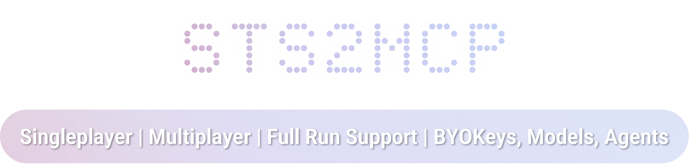

<p align="center">
  
</p>

<p align="center"><em>An Experimental Research Project to Fully-Automate your Slay the Spire 2 Runs</em></p>

A mod for [**Slay the Spire 2**](https://store.steampowered.com/app/2868840/Slay_the_Spire_2/) that lets AI agents play the game. Exposes game state and actions via a localhost REST API, with an optional MCP server for Claude Desktop / Claude Code integration.

Singleplayer and multiplayer (co-op) supported. Tested against STS2 `v0.99.1`.

> [!warning]
> This mod allows external programs to read and control your game via a localhost API. Use at your own risk with runs you care less about.

> [!caution]
> Multiplayer support is in **beta** — expect bugs. Any multiplayer issues encountered with this mod installed are very likely caused by the mod, not the game. Please disable the mod and verify the issue persists before reporting bugs to the STS2 developers.

## For Players

### 1. Install the Mod

Grab the [latest release](https://github.com/Gennadiyev/STS2MCP/releases/latest) and follow the instructions:

1. Copy `STS2_MCP.dll` and `STS2_MCP.json` to `<game_install>/mods/`
2. Launch the game and enable mods in settings (a consent dialog appears on first launch)
3. The mod starts an HTTP server on `localhost:15526` automatically

> [!note]
> The release DLL is a platform-agnostic .NET assembly — the same `STS2_MCP.dll` and `STS2_MCP.json` work on Windows, Linux, and macOS. No separate builds are needed.

#### macOS install

On macOS, the mods directory lives inside the app bundle. The default Steam install path is:

```
~/Library/Application Support/Steam/steamapps/common/Slay the Spire 2/
    SlayTheSpire2.app/Contents/MacOS/mods/
```

To install, right-click `SlayTheSpire2.app` → **Show Package Contents**, navigate to `Contents/MacOS/`, and create a `mods` folder. Or from the terminal:

```bash
GAME_DIR="$HOME/Library/Application Support/Steam/steamapps/common/Slay the Spire 2"
MODS_DIR="$GAME_DIR/SlayTheSpire2.app/Contents/MacOS/mods"
mkdir -p "$MODS_DIR"
cp STS2_MCP.dll "$MODS_DIR/"
cp STS2_MCP.json "$MODS_DIR/"
```

Launch the game and open **Settings → Mods**. The mod should appear in the list. A consent dialog appears on first launch — accept it to enable mod loading. Once enabled, verify the HTTP server is running:

```bash
curl -s http://localhost:15526/
```

A successful response looks like:

```json
{"message": "Hello from STS2 MCP v0.3.4", "status": "ok"}
```

If you get "Connection refused", the mod is not loaded — check that mods are enabled in the game's settings.

### 2. Give Your AI Instructions to Interact with the Game

**Clone or download the repository**, then:

| I prefer a skill | I prefer an MCP Server |
|---|---|
| Tell AI to reference docs/raw-*.md. Sit back, and watch it play. | Requires [Python 3.11+](https://www.python.org/) and [uv](https://docs.astral.sh/uv/). Follow the instructions below ⬇️ |

#### MCP server setup

Install [uv](https://docs.astral.sh/uv/) if you don't have it (macOS: `brew install uv`). Then run the server once to install dependencies:

```bash
uv run --directory /path/to/STS2_MCP/mcp python server.py --help
```

`uv` reads `mcp/pyproject.toml`, creates an isolated virtual environment, and installs the pinned dependencies from `mcp/uv.lock`. Subsequent runs reuse the environment instantly.

Add the server to your AI client's MCP config:

```json
{
  "mcpServers": {
    "sts2": {
      "command": "uv",
      "args": ["run", "--directory", "/path/to/STS2_MCP/mcp", "python", "server.py"]
    }
  }
}
```

**Claude Code**: add to your project's `.mcp.json`.
**Claude Desktop**: add to `claude_desktop_config.json` with the same config as above.
*Other agents should have similar config options for custom MCP servers.*

> [!tip]
> On macOS, use the absolute path to `uv` (e.g. `/opt/homebrew/bin/uv`) in the `command` field. GUI-launched apps may not inherit your shell's `PATH`, which would prevent the server from starting.

Restart your Claude session after adding the config. To verify the MCP server is working, ask Claude to call `get_game_state` — with the game running, it should return the current game state.

The MCP server accepts `--host` and `--port` options if you need non-default settings.

Flag `--no-trust-env` can be used to disable `requests` from picking up proxy settings from the environment, which can cause connection issues if you are running the server in a container.

## For Developers

### Build & Install

Requires [.NET 9 SDK](https://dotnet.microsoft.com/download/dotnet/9.0) and the base game.

**PowerShell** (recommended):

```powershell
# Pass game path directly:
.\build.ps1 -GameDir "D:\SteamLibrary\steamapps\common\Slay the Spire 2"

# Or set it once and forget:
$env:STS2_GAME_DIR = "D:\SteamLibrary\steamapps\common\Slay the Spire 2"
.\build.ps1
```

The script builds `STS2_MCP.dll` into `out/STS2_MCP/`. Copy it along with the manifest JSON to `<game_install>/mods/` to install:

```
out/STS2_MCP/STS2_MCP.dll           ->  <game_install>/mods/STS2_MCP.dll
mod_manifest.json                   ->  <game_install>/mods/STS2_MCP.json
```

### Build instructions for macOS

Install dotnet to compile the mod:

```bash
brew install dotnet@9
export DOTNET_ROOT="/opt/homebrew/opt/dotnet@9/libexec"
export PATH="$DOTNET_ROOT:$PATH"
```

Homebrew installs `dotnet@9` as keg-only, so the exports above are required for the current session. Add them to `~/.zshrc` to persist across sessions.

Build with `dotnet` directly (the PowerShell script is Windows-only):

```bash
dotnet build STS2_MCP.csproj -c Release -o out/STS2_MCP \
  -p:STS2GameDir="$HOME/Library/Application Support/Steam/steamapps/common/Slay the Spire 2"
```

On macOS the game ships as an app bundle. The `.csproj` detects macOS and resolves the data directory to `SlayTheSpire2.app/Contents/Resources/data_sts2_macos_arm64` automatically.

The mods directory on macOS lives inside the app bundle at `SlayTheSpire2.app/Contents/MacOS/mods/`. Finder hides bundle contents by default — to browse it in the GUI, right-click `SlayTheSpire2.app` → **Show Package Contents**. Or copy from the terminal:

```bash
GAME_DIR="$HOME/Library/Application Support/Steam/steamapps/common/Slay the Spire 2"
MODS_DIR="$GAME_DIR/SlayTheSpire2.app/Contents/MacOS/mods"
mkdir -p "$MODS_DIR"
cp out/STS2_MCP/STS2_MCP.dll "$MODS_DIR/"
cp mod_manifest.json "$MODS_DIR/STS2_MCP.json"
```

> [!NOTE] 
> `mod_manifest.json` is renamed to `STS2_MCP.json` on copy — the game's mod loader expects the manifest filename to match the mod ID.

## License

MIT

## FAQ

### Why let the AI play the game for me?

I start building this mod with the hope that I can co-op with an AI player. Singleplayer is originally just built for validation.

### You did not answer the question!

First of all, I play lots of games, including service games that has daily/weekly tasks. I really hoped that modern AI could save me from the grind, which, if you have tried one or more of the GUI agents, never really materialized. Let's face it: modern AI is still pretty bad at gaming because no one cares.

About my intention, as a researcher that loves playing games, the purpose of STS2MCP is to test AI models and agents in a rarely explored (we call it out-of-distribution) domain. Ultimately, this might turn into a benchmark for evaluating the reasoning and decision-making capabilities of different language models.

STS2 is just an example to show how good (or bad) current AI agents are at playing such games. **I have no intention to replace human players with AI, and I would definitely rather play STS2 myself** as a big fan of the game.

### Is this a cheat mod?

It can be, but it doesn't have to be. The mod itself does not alter the gameplay. It is just an interface that allows external programs to interact with the game. What you do with that interface is up to you.

### How many tokens do a run consume?

I evaluated on the Ironclad. Claude Sonnet 4.6 uses slightly more than 8M tokens (counting both input, output and tool responses) for a full run. GPT-5.4 averages 7.34M tokens. Depending on your prompt and model choice, it can be more or less.

### Do you have a roadmap for future features?

The project is still too early to have a clear roadmap. My current focus is to make sure the core features are stable and well-documented. However, I am open to suggestions and contributions from the community.

- Solidifying multiplayer features and fixing bugs is a priority
- Add support for in-game communication in multiplayer runs when collaborating with an AI agent
- Self-reflection and learning from past runs to improve future performance
- Benchmarking different models and agents is also on my mind
